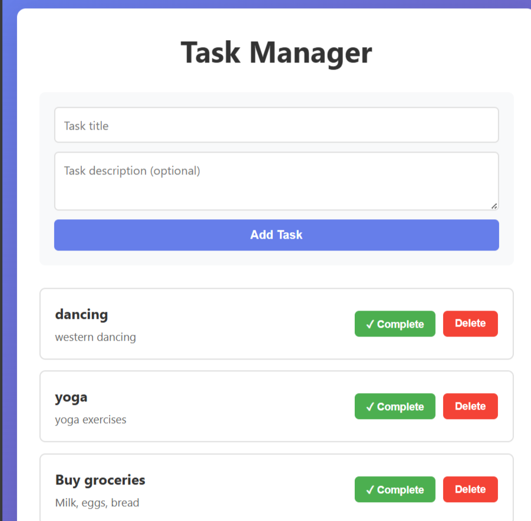

# Task Manager Application

A full-stack task management application built with React, Node.js, Express, and PostgreSQL.

## 🚀 Features

- ✅ Create, read, update, and delete tasks
- 📊 Filter tasks by status (All, Pending, Completed)
- 🎯 Mark tasks as complete/incomplete
- 🎨 Modern, responsive UI with React
- 🔒 RESTful API with Express
- 💾 PostgreSQL database for data persistence

## 🛠️ Tech Stack

**Frontend:**
- React 18
- Axios for API calls
- CSS3 for styling

**Backend:**
- Node.js
- Express.js
- PostgreSQL
- pg (node-postgres)
- dotenv for environment variables
- cors for cross-origin requests

## 📋 Prerequisites

Before running this project, make sure you have:

- Node.js (v14 or higher)
- PostgreSQL (v12 or higher)
- npm or yarn

## ⚙️ Installation & Setup

### 1. Clone the repository

```bash
git clone https://github.com/samadhiniperera/task-manager-app.git
cd task-manager-app
```

### 2. Database Setup

```bash
# Login to PostgreSQL
psql -U postgres

# Create database
CREATE DATABASE taskmanager;

# Create tasks table
CREATE TABLE tasks (
    id SERIAL PRIMARY KEY,
    title VARCHAR(255) NOT NULL,
    description TEXT,
    status VARCHAR(50) DEFAULT 'pending',
    created_at TIMESTAMP DEFAULT CURRENT_TIMESTAMP
);

# Exit PostgreSQL
\q
```

### 3. Backend Setup

```bash
cd backend
npm install
```

Create `.env` file in the backend directory:

```env
PORT=5000
DB_USER=postgres
DB_HOST=localhost
DB_NAME=taskmanager
DB_PASSWORD=your_password
DB_PORT=5432
```

Start the backend server:

```bash
npm start
```

The API will run on `http://localhost:5000`

### 4. Frontend Setup

Open a new terminal:

```bash
cd frontend
npm install
npm start
```

The application will open at `http://localhost:3000`

## 📁 Project Structure

```
task-manager-app/
├── backend/
│   ├── server.js          # Express server & API routes
│   ├── db.js              # Database configuration
│   ├── package.json
│   └── .env               # Environment variables (not in git)
├── frontend/
│   ├── public/
│   ├── src/
│   │   ├── components/
│   │   │   ├── TaskForm.js
│   │   │   └── TaskList.js
│   │   ├── App.js
│   │   ├── App.css
│   │   └── index.js
│   └── package.json
├── .gitignore
└── README.md
```

## 🔌 API Endpoints

| Method | Endpoint | Description |
|--------|----------|-------------|
| GET | `/api/tasks` | Get all tasks |
| GET | `/api/tasks?status=pending` | Get filtered tasks |
| POST | `/api/tasks` | Create a new task |
| PUT | `/api/tasks/:id` | Update a task |
| DELETE | `/api/tasks/:id` | Delete a task |

## 📸 Screenshots



## 🎯 Future Enhancements

- [ ] User authentication and authorization
- [ ] Task categories and tags
- [ ] Due dates and reminders
- [ ] Search functionality
- [ ] Dark mode
- [ ] Task priority levels
- [ ] File attachments

## 🤝 Contributing

Contributions are welcome! Feel free to submit issues or pull requests.

## 📝 License

This project is open source and available under the MIT License.

## 👤 Author

**Samadhini Perera**
- GitHub: [@samadhiniperera](https://github.com/samadhiniperera)
- LinkedIn: [LinkedIn](https://www.linkedin.com/in/samadhini-perera-263a842b8/)

## 🙏 Acknowledgments

- Built as a portfolio project to demonstrate full-stack development skills
- Thanks to the open-source community for the amazing tools and libraries